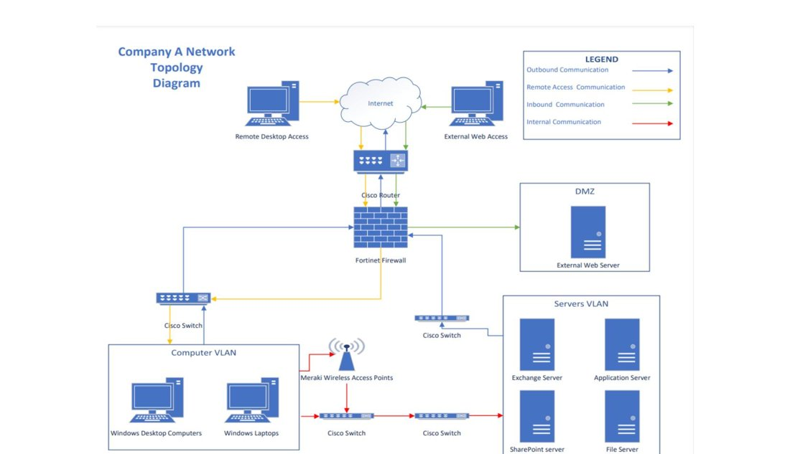
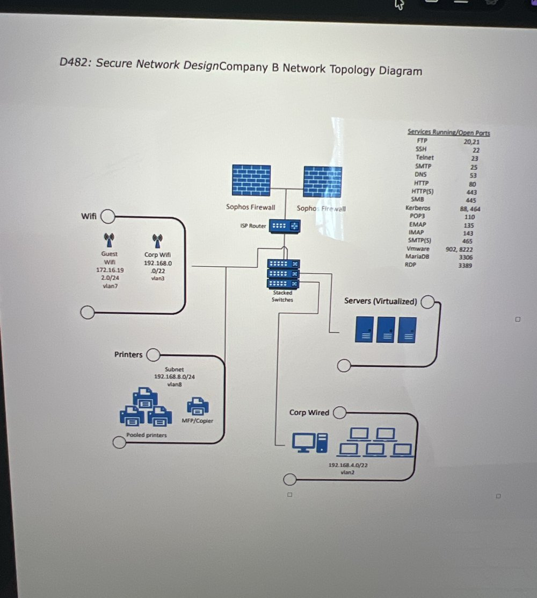
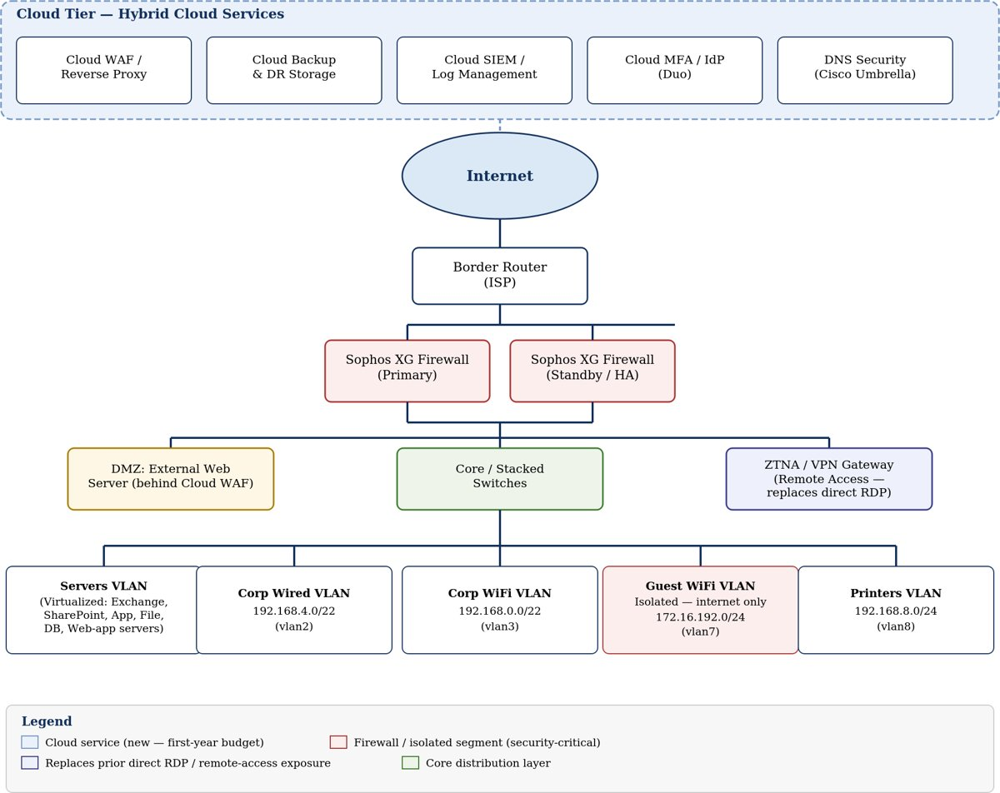
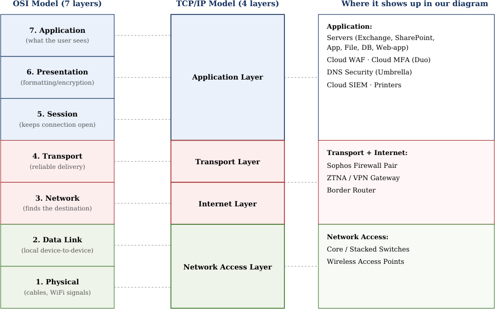
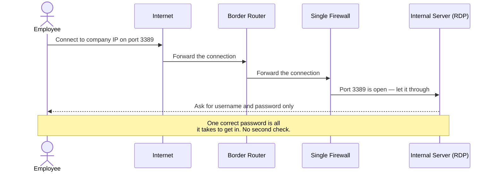
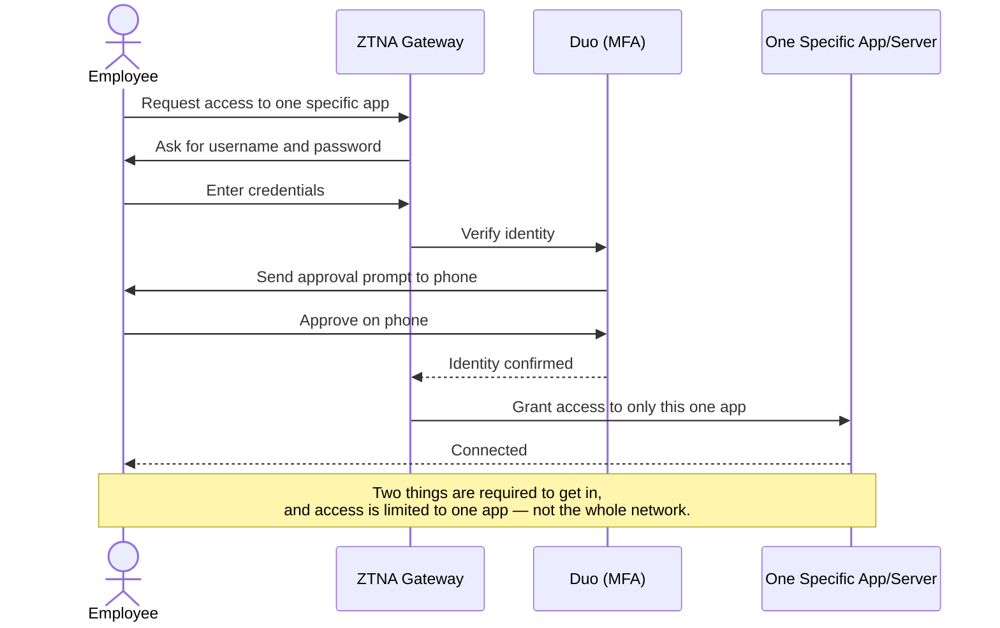
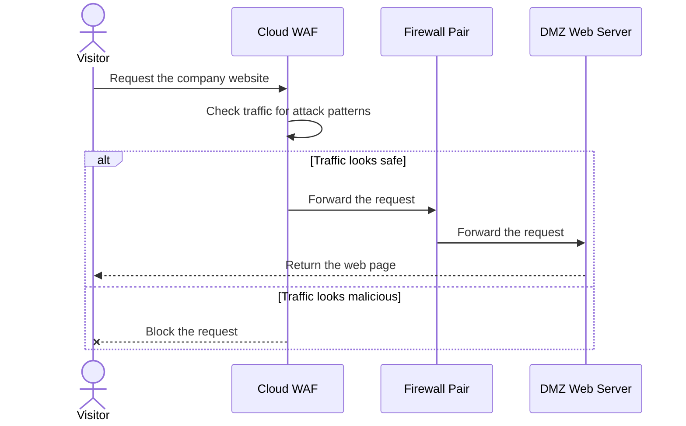
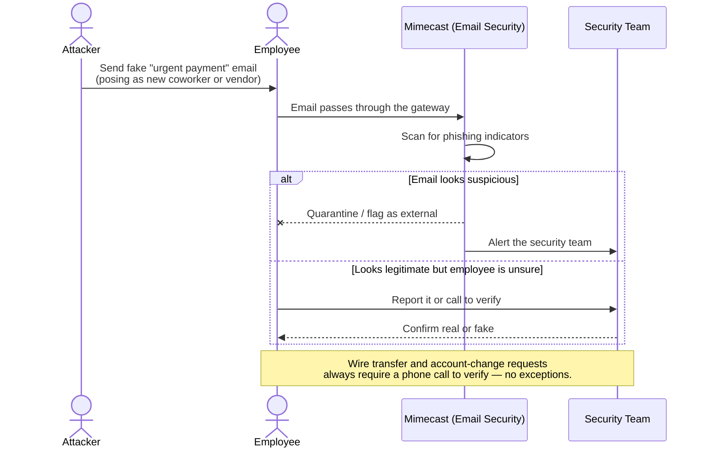
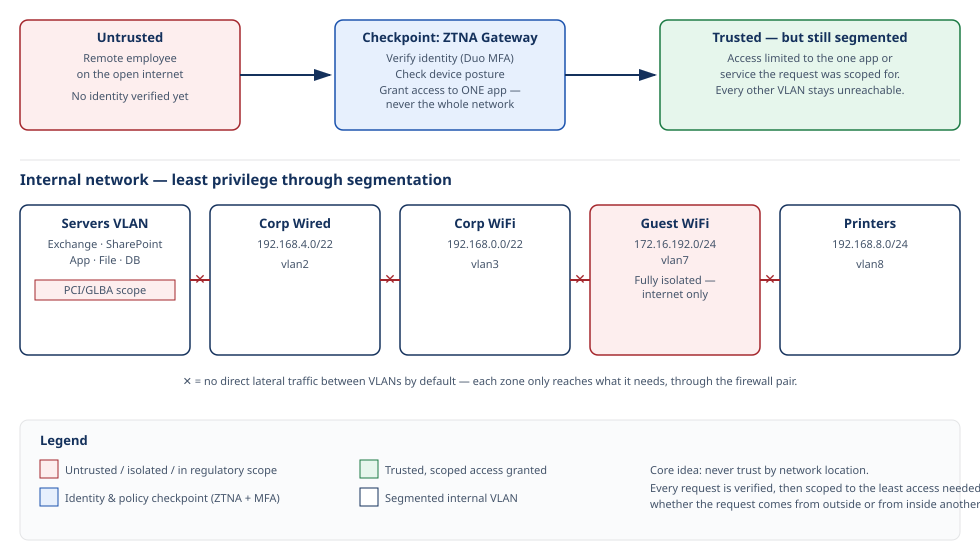
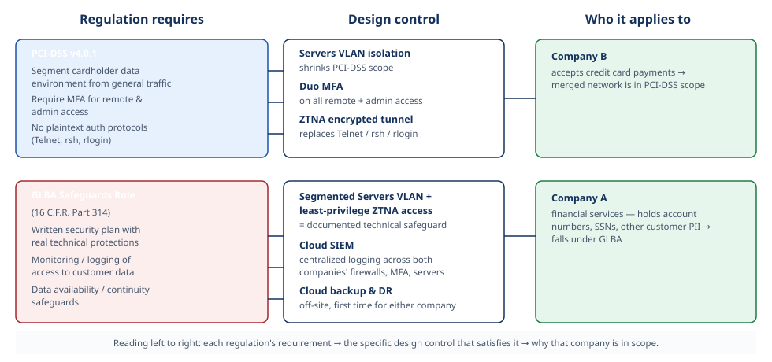

# Secure Network Design: A Company Merger Case Study

Designing a zero trust, budget-constrained network architecture for two merging companies — from risk assessment through to a defensible, cost-justified recommendation.

`NIST SP 800-30 Risk Assessment` · `Zero Trust Architecture` · `Network Segmentation` · `PCI-DSS & GLBA Mapping` · `Vulnerability Analysis` · `Budget-Driven Design`

## About This Project

Two companies have just merged. One runs on outdated, single-point-of-failure infrastructure and handles sensitive financial data; the other has never had a dedicated security function and is carrying more than a dozen exploitable vulnerabilities, some of them critical. I was given the role of the security professional responsible for bringing these two networks together — securely, on a fixed first-year budget of $50,000, and without slowing the business down.

This project walks through my full process: analyzing the risk and vulnerability data for both companies, designing a merged network architecture built on zero trust and defense-in-depth principles, mapping every component to the OSI and TCP/IP models, justifying every dollar of the budget, and tying the design back to real regulatory requirements (PCI-DSS and GLBA). It was built as part of my graduate coursework in cybersecurity and information assurance, and I'm presenting it here as a case study of how I think through a security design problem end to end.

:::tip How to read this page
Every diagram below is interactive-in-spirit — the sequence diagrams in particular are meant to show *how* traffic actually behaves, not just where the boxes sit. No deep networking background required; terms are explained as they come up.
:::

## Skills Demonstrated

| | |
|---|---|
| **🔍 Risk & Vulnerability Assessment** | Applied NIST SP 800-30 methodology to classify risk by likelihood and severity, and analyzed a CVSS-based vulnerability scan to prioritize real, exploitable issues over theoretical ones. |
| **🏗️ Secure Network Architecture** | Designed a merged topology applying zero trust and defense-in-depth, using network segmentation (VLANs) and a Zero Trust Network Access gateway to replace direct internet-facing remote access. |
| **💰 Budget-Constrained Decision Making** | Built a first-year cloud services budget that fit exactly within a fixed $50,000 constraint, reusing existing hardware instead of over-purchasing. |
| **📋 Regulatory Compliance Mapping** | Connected specific design decisions to specific requirements under PCI-DSS v4.0.1 and the GLBA Safeguards Rule (16 C.F.R. Part 314). |

## The Business Challenge

Company A is a U.S. financial services company — checking accounts, bank cards, investment products — which means it holds sensitive customer PII and falls under GLBA. Company B is a smaller company offering specialized software to medical providers and accepting credit card payments, which brings PCI-DSS into scope. Company B has no dedicated security function and relies on third-party support. The merged executives want to move toward the cloud for scalability and redundancy, apply zero trust principles, and stay within a $50,000 first-year budget for cloud-based security services.

## Company A's Network — Before

Here's how Company A's network was set up going into the merger.

- Traffic from the internet comes in through a single **border router**, then a single **firewall**, before splitting into a **DMZ** (public website), a **Servers VLAN** (email, file storage, internal apps), and a **Computer VLAN** for employee desktops, laptops, and WiFi.
- **The core problem:** one router and one firewall means one failure point. If either goes down — or gets taken down — the entire company loses connectivity.

### Two Security Problems

**Too many open ports.** Company A's firewall leaves ports 21 through 90 open, plus port 3389, and the risk analysis marks this High likelihood. Port 21 (FTP) sends data unencrypted; port 3389 (RDP) is a favorite attacker target. Combined with the sensitive PII Company A stores, this is a meaningful exposure for a financial company.

**Weak password and access rules.** Passwords are only eight characters, never expire, and every user has local admin rights on their own machine. Short, static passwords are easy to crack over time, and admin rights on every endpoint mean a single compromised account can do outsized damage — directly at odds with the zero trust goal.

### Two Infrastructure Problems

**Old, unsupported systems still in production.** 14 laptops on Windows 7, plus servers on Windows Server 2012/2012 R2 — years past their last security update, and one of them runs the application server. This is exactly the kind of thing that becomes an audit finding.

**No redundancy for the firewall or router.** A single point of failure for the entire company's internet connectivity — directly against the executives' stated goal of more redundancy through the cloud.

## Company B's Network — Before

Here's Company B's network before the merger.

- Company B does get a couple of things right already: **two firewalls working as a pair**, and separate zones for Guest WiFi, Corporate WiFi, Printers, Corporate Wired, and Servers.
- The open-ports list shown on the diagram includes legacy, unencrypted protocols like **Telnet** and plain **FTP** — and this list lines up directly with several of the findings in the vulnerability scan below.

### Two Security Problems

**No multi-factor authentication anywhere.** Flagged High risk and High severity in the vulnerability scan, and made worse by other findings — a PostgreSQL admin panel reachable straight from the internet, and weak brute-force protection on VNC and FTP. Since Company B processes credit card payments, this is a direct PCI-DSS gap.

**Critical, unpatched remote code execution bugs on public-facing systems.** A dRuby vulnerability, a Java RMI vulnerability on a publicly exposed server, and the well-known "Ghostcat" Apache Tomcat bug — none of which require a password to exploit.

### Two Infrastructure Problems

**Windows XP still in production** — unpatched since 2014 — with no device management software in place and a written security policy still listed as "in progress."

**A consumer-grade home router protecting ~20 servers and payment card data.** Not built for business traffic, VPN needs, or redundancy, and it's a single point of failure on top of that.

## Key Vulnerabilities, In Context

Pulling from both companies' network diagrams and vulnerability data, four vulnerabilities stood out as the ones the new design had to solve for directly:

### Company A — Open Ports 21–90 and 3389
The network diagram confirms this range is actively used for Remote Desktop Access and External Web Access, not just left open by accident — so it's a live exposure, not a theoretical one.

### Company A — Universal Local Admin Rights
Every account on the Computer VLAN has local admin rights, and that VLAN has a direct path to the Servers VLAN (Exchange, SharePoint, the application server, file storage). One compromised endpoint is one hop from the crown jewels.

### Company B — Legacy Unencrypted Remote-Access Protocols
Telnet, FTP, and RDP are all active, backed up by specific scan findings: an exposed Rexec service, rlogin allowing password-less access, and rsh transmitting credentials in plaintext. Anyone on the network — even someone on Guest WiFi — could potentially capture that traffic.

### Company B — No MFA, Anywhere
Compounded by the exposed RDP port and the internet-reachable PostgreSQL admin panel — MFA is exactly the control that would blunt both.

## Impact, Risk & Likelihood

| Vulnerability | Risk | Likelihood | What Could Happen |
|---|---|---|---|
| Company A — open ports 21–90, 3389 | High | High | FTP sends login info in plaintext; RDP is brute-forceable from outside. Given the PII Company A stores, a breach here means real legal exposure and reputational damage. |
| Company A — universal admin rights | Moderate | Moderate | Less severe on its own — an attacker needs an initial foothold, usually phishing — but once in, admin rights let them disable security tools and pivot toward the servers quickly. |
| Company B — legacy remote-access protocols | High | High | Actively reachable right now, each with a documented scan finding. Plaintext credentials mean anyone on the internal network can potentially intercept them. |
| Company B — no MFA | High | High | Compounds the exposed RDP port and the exposed database admin panel. One leaked password is enough — and it puts Company B out of line with PCI-DSS. |

## The Proposed Merged Network

This is the design I proposed for the combined company — it keeps what already works, and directly resolves every issue surfaced above.

- **No more single point of failure:** the design standardizes on Company B's existing Sophos firewall pair for the whole merged company.
- **Cloud services layered on top:** a web application firewall, a ZTNA remote-access gateway, MFA (Duo), DNS security (Cisco Umbrella), cloud backup, and centralized logging (SIEM).
- **Everything gets its own zone:** Servers, Corporate Wired, Corporate WiFi, Guest WiFi, and Printers each sit on their own VLAN.
- **Remote access is locked down:** employees connect through the ZTNA gateway — RDP is no longer reachable straight from the internet.

## OSI & TCP/IP Layer Mapping

Every component in the diagram maps to a layer in both the OSI and TCP/IP models — useful for showing exactly where each control operates and why it belongs there.

| Component | OSI Layer | TCP/IP Layer |
|---|---|---|
| Border Router (ISP) | Network (Layer 3) | Internet Layer |
| Sophos XG Firewall (HA Pair) | Network/Transport (3–4), app-layer inspection | Internet/Transport Layer |
| Cloud WAF / Reverse Proxy | Application (Layer 7) | Application Layer |
| ZTNA / VPN Gateway | Network/Transport (3–4) | Internet/Transport Layer |
| Cloud MFA / Identity Provider (Duo) | Application (Layer 7) | Application Layer |
| DNS Security (Cisco Umbrella) | Application (Layer 7) | Application Layer |
| Cloud Backup & DR Storage | Application (Layer 7) | Application Layer |
| Cloud SIEM / Log Management | Application (Layer 7) | Application Layer |
| Core / Stacked Switches | Data Link (Layer 2) | Network Access Layer |
| Wireless Access Points | Physical/Data Link (1–2) | Network Access Layer |
| DMZ External Web Server | Application (Layer 7) | Application Layer |
| Servers VLAN (Exchange, SharePoint, App, File, DB, Web-app) | Application (Layer 7) | Application Layer |
| Corp Wired / Corp WiFi / Guest WiFi endpoints | Application (Layer 7, end-host) | Application Layer |
| Printers VLAN (MFP/Copier) | Application (Layer 7, print protocols) | Application Layer |

## Design Rationale & Budget

### Reuse the Existing Sophos Firewall Pair — Don't Buy New Hardware
Rather than purchasing new redundant hardware for Company A, the design standardizes on the two Sophos firewalls Company B already runs as an HA pair; Company A's single Fortinet is retired from that role. This solves the single-point-of-failure problem at effectively zero hardware cost.

### Add a Cloud WAF
Sits in front of the external web server, filtering malicious traffic before it ever reaches the network — directly addressing the open-port and public-server exposures. **Est. first-year cost: $5,000.**

### Add a ZTNA / VPN Gateway
Replaces the practice, at both companies, of exposing RDP directly to the internet. Employees connect through an authenticated tunnel instead. **Est. first-year cost: $16,000.**

### Extend Cloud MFA (Duo) to Company A
Company B already uses Duo — this simply extends it company-wide, closing the "no MFA" and weak-password gaps. **Est. first-year cost: $3,000.**

### Extend DNS Security (Cisco Umbrella) to Company A
Same logic — already in place at Company B, extended to block connections to known-bad domains before a device can reach them. **Est. first-year cost: $4,000.**

### Add Cloud Backup & Disaster Recovery
Neither company has off-site backup today. This delivers the redundancy the executives asked for and protects the data on the Servers VLAN. **Est. first-year cost: $4,000.**

### Add Cloud-Based Logging (SIEM)
Centralizes logs from both companies' firewalls, MFA activity, and servers — visibility neither company has today, and support for GLBA/PCI-DSS monitoring expectations. **Est. first-year cost: $5,000.**

### Budget Summary

| Item | Change | Est. First-Year Cost |
|---|---|---|
| Existing Sophos XG HA pair (retire Company A's Fortinet) | Delete / Repurpose | $0 (existing hardware reused) |
| Cloud WAF / reverse proxy for the DMZ web server | Add | $5,000 |
| ZTNA / VPN gateway (replaces direct RDP exposure) | Add | $16,000 |
| Duo MFA — extend to Company A users | Add | $3,000 |
| Cisco Umbrella DNS security — extend to Company A | Add | $4,000 |
| Cloud backup & disaster recovery storage | Add | $4,000 |
| Cloud SIEM / centralized log management | Add | $5,000 |
| Implementation labor / contingency | — | $13,000 |
| **Total** | | **$50,000** |

## Remote Access — Before ⚠️ Risky

What happens, step by step, when an employee connects remotely under the *original* setup — RDP open directly to the internet, no MFA.

:::note
This is exactly the open-port-3389 exposure identified above — anyone who guesses or steals one password is in.
:::

## Remote Access — After ✅ Secure

The same task under the new design — through the ZTNA gateway, with MFA required.

:::tip
This is **Zero Trust** in action: every connection is checked, and access is limited to the one thing the employee actually needs.
:::

## A Website Visit, Step by Step

How a normal visitor reaches the public website in the DMZ, now that the Cloud WAF is in place.

:::info
This is **Defense in Depth**: the WAF filters traffic before it ever reaches the firewall or the web server itself.
:::

## Phishing Attempt — Detection & Response

Mergers are prime phishing territory — employees from both companies don't know each other yet, which makes it easier to impersonate a new coworker or vendor. Here's how the design handles a phishing attempt targeting a merger-period employee.

:::warning Why this matters
Company A handles financial accounts, which makes payment-related social engineering especially costly if it succeeds. The control here isn't just technology — it's a mandatory verification step in the process itself.
:::

## Secure Network Design Principles

### Defense in Depth
The design layers more than one control instead of relying on any single one. Traffic hits the cloud WAF first, then the firewall pair, then gets split by VLAN — if one layer is bypassed, the next is still there. The diagram makes this visible: Cloud WAF → Firewall Pair → Core Switch → separate VLANs.

### Zero Trust / Least Privilege Through Segmentation
Instead of trusting everything inside the network by default, traffic is split by purpose — Servers, Corp Wired, Corp WiFi, Guest WiFi, and Printers each get their own VLAN, with Guest WiFi fully isolated. Remote employees no longer connect through an open RDP port; they go through the ZTNA gateway, which verifies identity and grants access to only what's needed — the core idea behind zero trust.

## Regulatory Compliance

### PCI-DSS (v4.0.1)
**Why it applies:** Company B accepts credit card payments, so the merged network falls under PCI-DSS, published by the PCI Security Standards Council.

**How the design meets it:** the Servers VLAN holding payment data is isolated from Guest WiFi, Printers, and general office traffic, shrinking the PCI-DSS scope. MFA via Duo is required for all remote and admin access — a core PCI-DSS control. The unencrypted legacy protocols found in the assessment (Telnet, rsh, rlogin) are removed, replaced by the encrypted ZTNA connection.

### GLBA Safeguards Rule
**Why it applies:** Company A is a financial company holding private customer data (account numbers, SSNs). The FTC's Safeguards Rule (16 C.F.R. Part 314), under the Gramm-Leach-Bliley Act, requires a written security plan with real technical protections.

**How the design meets it:** the segmented Servers VLAN and least-privilege ZTNA access both count as technical safeguards. The cloud SIEM supports the monitoring requirement, and cloud backup supports the data-availability requirement the Safeguards Rule calls for.

## Emerging Threats

### Cloud Misconfiguration
**Risk:** five new cloud services means five new places to misconfigure — an open storage bucket, over-permissioned account, or a WAF rule left in monitor-only mode could quietly reintroduce the exact problems this design fixes.

**Performance impact:** traffic through the WAF and ZTNA gateway adds one extra hop, which can add a small delay under heavy load.

**Mitigation:** automated cloud security posture monitoring, infrastructure templated consistently every time, and least-privilege access for every cloud service.

### Phishing During the Merger
**Risk:** unfamiliarity between the two newly merged workforces makes impersonation easier — especially around payment and account-change requests, which matters given Company A's financial focus. (See the sequence diagram above.)

**Performance impact:** expanding Mimecast coverage and running training adds minor email delay and some employee time.

**Mitigation:** Mimecast extended company-wide, hardware security keys for finance/executive accounts, merger-specific phishing training, and mandatory phone verification before any wire transfer or account-change request.

## Recommendation & Cost-Benefit Summary

| | |
|---|---|
| **On-Premises Only** | Avoids subscription costs and keeps full hardware control, but real redundancy — a second firewall, second router, off-site backup — means a large upfront purchase that exceeds $50,000 for a network this size, and it still wouldn't close the MFA, WAF, or logging gaps. |
| **Cloud-Augmented (Recommended)** | Converts these needs into predictable costs that fit the fixed first-year budget, with built-in backup and room to grow — exactly what the executives asked for. Trade-off: ongoing monthly cost and reliance on internet connectivity and the cloud provider's uptime. |

**My recommendation:** a hybrid approach — keep the servers and the already-owned Sophos firewalls on-premises, and layer the cloud services (WAF, ZTNA, MFA, DNS security, backup, SIEM) on top. This uses hardware that's already paid for and puts the entire $50,000 toward fixing the actual problems identified in the assessment, rather than duplicating equipment the two companies already own between them.

This plan resolves every major issue surfaced in the assessment: it closes the open ports and legacy protocols with the ZTNA gateway, eliminates the single point of failure by reusing the existing Sophos pair, adds MFA and segmentation to support zero trust, and satisfies both PCI-DSS and GLBA — all within budget, and without replacing hardware either company already owns.

## Standards & References

- Federal Trade Commission. (2021). *Standards for Safeguarding Customer Information* (16 C.F.R. Part 314). https://www.ecfr.gov/current/title-16/chapter-I/subchapter-C/part-314
- PCI Security Standards Council. (2024). *Payment Card Industry Data Security Standard* (Version 4.0.1). https://www.pcisecuritystandards.org/
- National Institute of Standards and Technology. *NIST SP 800-30 Rev. 1 — Guide for Conducting Risk Assessments.*

:::note Case study note
Company A and Company B are a fictional scenario built for a graduate cybersecurity risk-assessment and network-design exercise. The underlying network diagrams, risk analysis, and vulnerability scan data were provided as part of that exercise; the architecture, budget, rationale, and write-up are my own work.
:::

## About Me

I'm Pratima Bista — currently completing my Master's in Cybersecurity and Information Assurance, working toward a career in Governance, Risk, and Compliance. Projects like this one are how I practice thinking the way a security team actually has to: balancing real risk against a real budget, and being able to explain both the technical detail and the "why" behind it to people who aren't in the weeds day to day.
